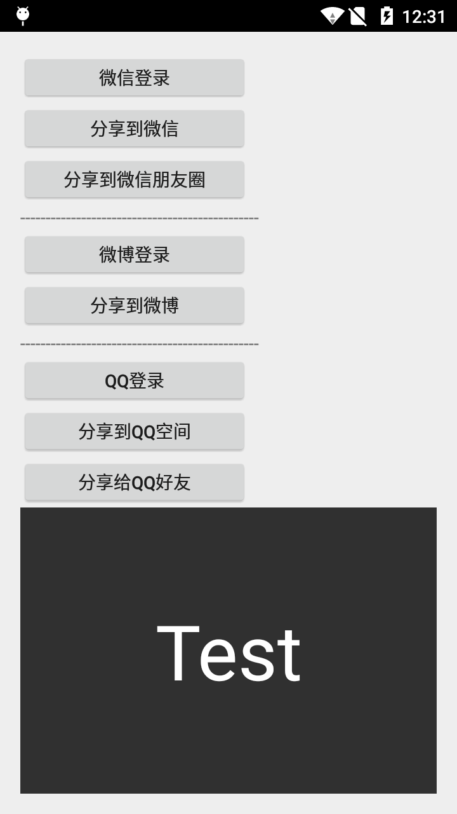

# ShareLoginLib
ShareLoginLib likes simple sharesdk or umeng in China . It is a tool to help developers to share their content (image , text or music ) to WeChat,Weibo and QQ .

# Including in your project
-------------------------

```groovy
compile 'com.echodjb.shareloginlib:share:0.3'
```


# How to use (参考MainActivity)
-------------------------

#### 1.添加混淆参数
```  
  
-keep class com.tencent.mm.sdk.** {
   *;
}  

```  

#### 2.在包名下新建wxapi这个包，然后放入WXEntryActivity  
Activity的写法如下：  

```JAVA   
package com.kale.share.wxapi;

/**
 * Created by echo on 10/11/14.
 */

import com.liulishuo.share.wechat.WechatHandlerActivity;

/** 
 * -----------------------------------------------------------------------
 * 这是微信客户端回调activity.
 * 必须在项目包名下的wxapi中定义，类名也不能改。奇葩到一定境界了！
 * eg:com.kale.share是你的项目包名，那么这个类一定要放在com.kale.share.wxapi中才行。
 * 而且千万不要更改类名，请保持WXEntryActivity不变
 * WTF：真是微信蠢到家的设计，太愚蠢了
 * -----------------------------------------------------------------------
 * */
public class WXEntryActivity extends WechatHandlerActivity {}  

```

#### 3.在项目工程的manifest中配置Activity  
```XML  
<!-- 腾讯的认证activity -->
        <activity
            android:name="com.tencent.tauth.AuthActivity"
            android:launchMode="singleTask"
            android:noHistory="true"
            >
            <intent-filter>
                <action android:name="android.intent.action.VIEW" />

                <category android:name="android.intent.category.DEFAULT" />
                <category android:name="android.intent.category.BROWSABLE" />

                <!-- 这里需要换成:tencent+你的AppId -->
                <data android:scheme="tencent123456" />
            </intent-filter>
        </activity>

		<!-- 处理微信回调的Activity -->
        <activity
            android:name=".wxapi.WXEntryActivity"
            android:exported="true"
            android:screenOrientation="portrait"
            android:theme="@android:style/Theme.NoDisplay"
            />  
```

#### 4.在项目中使用第三方SDK功能前进行参数的注册  
```java  

   ShareBlock.getInstance()
                .initAppName("TestAppName")
                .initQQ(OAuthConstant.QQ_APPID, OAuthConstant.QQ_SCOPE)
                .initWechat(OAuthConstant.WECHAT_APPID, OAuthConstant.WECHAT_SECRET)
                .initWeibo(OAuthConstant.WEIBO_APPID, OAuthConstant.WEIBO_REDIRECT_URL, OAuthConstant.WEIBO_SCOPE);
```  

#### 5.登录和分享的回调接口  
```java
  private LoginListener mLoginListener = new LoginListener() {
        public static final String TAG = "LoginListener";

        @Override
        public void onLoginComplete(String uId, String accessToken, long expiresIn) {
            Log.d(TAG, "uid = " + uId);
            Log.d(TAG, "accessToken = " + accessToken);
            Log.d(TAG, "expires_in = " + expiresIn);
            // 如果是微信登录，这个回调是在新线程中的，不是在主线程中。所以请不要进行ui操作！
            Log.d(TAG, "登录成功");
            Toast.makeText(getBaseContext(), "登录成功", Toast.LENGTH_SHORT).show();
        }

        @Override
        public void onError(String msg) {
            Toast.makeText(getBaseContext(), "登录失败,失败信息：" + msg, Toast.LENGTH_SHORT).show();
        }

        @Override
        public void onCancel() {
            Log.d(TAG, "取消登录");
            Toast.makeText(getBaseContext(), "取消登录", Toast.LENGTH_SHORT).show();
        }
    };

    private ShareStateListener mShareListener = new ShareStateListener() {
        @Override
        public void onComplete() {
            Log.d(TAG, "分享成功");
            Toast.makeText(getBaseContext(), "分享成功", Toast.LENGTH_SHORT).show();
        }

        @Override
        public void onError(String msg) {
            Log.d(TAG, "分享失败，出错信息：" + msg);
            Toast.makeText(getBaseContext(), "分享失败，出错信息：" + msg, Toast.LENGTH_SHORT).show();
        }

        @Override
        public void onCancel() {
            Log.d(TAG, "取消分享");
            Toast.makeText(getBaseContext(), "取消分享", Toast.LENGTH_SHORT).show();
        }
    };
 ```
#### 6.在使用第三方功能的Activity的onActivityForResult中进行如下配置

```java  
  @Override
    protected void onActivityResult(int requestCode, int resultCode, Intent data) {
        super.onActivityResult(requestCode, resultCode, data);
        ShareBlock.handlerOnActivityResult(mCurrentLoginManager, mCurrentShareManager, requestCode, resultCode, data);
    }
 ```  

#### 7.如何进行登录和分享  
```JAVA  
        findViewById(R.id.login_weibo_btn).setOnClickListener(new View.OnClickListener() {
            @Override
            public void onClick(View view) {
                mCurrentLoginManager = new WeiboLoginManager(MainActivity.this);
                mCurrentLoginManager.login(mLoginListener);
            }
        });

        findViewById(R.id.share_weibo_btn).setOnClickListener(new View.OnClickListener() {
            @Override
            public void onClick(View view) {
                mCurrentShareManager = new WeiboShareManager(MainActivity.this);
//                mCurrentShareManager.share(new ShareContentText("test"), WeiboShareManager.WEIBO_SHARE_TYPE, mShareListener);
                mCurrentShareManager.share(
                        new ShareContentWebpage("hello", "lalala", "http://www.liulishuo.com", bitmap)
                        , WeiboShareManager.WEIBO_SHARE_TYPE, mShareListener);
            }
        }); 
```  
更多详细的操作请参考demo

# Demo
-------------------------



# LICENCE
-------------------------

  The MIT License (MIT)

  Copyright (c) 2015 LingoChamp Inc.

  Permission is hereby granted, free of charge, to any person obtaining a copy
  of this software and associated documentation files (the "Software"), to deal
  in the Software without restriction, including without limitation the rights
  to use, copy, modify, merge, publish, distribute, sublicense, and/or sell
  copies of the Software, and to permit persons to whom the Software is
  furnished to do so, subject to the following conditions:

  The above copyright notice and this permission notice shall be included in
  all copies or substantial portions of the Software.

  THE SOFTWARE IS PROVIDED "AS IS", WITHOUT WARRANTY OF ANY KIND, EXPRESS OR
  IMPLIED, INCLUDING BUT NOT LIMITED TO THE WARRANTIES OF MERCHANTABILITY,
  FITNESS FOR A PARTICULAR PURPOSE AND NONINFRINGEMENT. IN NO EVENT SHALL THE
  AUTHORS OR COPYRIGHT HOLDERS BE LIABLE FOR ANY CLAIM, DAMAGES OR OTHER
  LIABILITY, WHETHER IN AN ACTION OF CONTRACT, TORT OR OTHERWISE, ARISING FROM,
  OUT OF OR IN CONNECTION WITH THE SOFTWARE OR THE USE OR OTHER DEALINGS IN
  THE SOFTWARE.